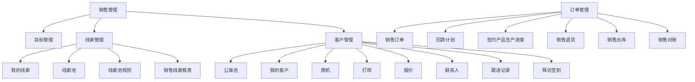

# CRM 电脑端 · 低代码菜单对照

> 2026-09-23。客户演示用的低代码 CRM 是电脑端销售菜单和页面的对照。本文是销售管理的冻结方案。  
> 手机仍按 [CRM销售移动端-优化方案.md](CRM销售移动端-优化方案.md)。角色金额、禁止写回 `so_order.due_date` 仍以 [第二次演示后-完整升级方案.md](第二次演示后-完整升级方案.md) §5.3–§5.4 为准。拜访满 15 分钟才能确认写入，以本文「拜访签到」为准。  
> 与 [低代码借鉴-销售领料与人工边界-升级方案.md](低代码借鉴-销售领料与人工边界-升级方案.md) 里「不新开菜单、不做公海线索池」冲突的，以本文为准。真 GPS、本系统内过账出库、销售对账、实时金蝶接口，仍然不做。回款、开票、发货只读现有模拟同步。

一条链：线索 → 客户 → 商机 → 打样 → 报价 → 签约订单 → 进度大盘。跟进只有一张表，类型标出落在线索、商机还是客户。

演示时用同一张订单把进度大盘的颜色讲完。回款计划菜单打开的是订单上的同一批回款行。联系人、销售退货、销售对账只留入口，页上写明本轮不做。

## 菜单怎么挂

能对上现有数据的，点开就是现在的页，只改菜单名：

- **目标管理**：单独设计，见下一节。现有 `crm_sales_goal` 只有「人 × 指标」四个次数，没有年、月、周，列表页要换成可展开的目标树。
- **我的客户**：单独设计，见「客户」一节。列表左侧按行业类型树筛选，点开仍是现有客户 360，并加上跟进时间线。
- **商机**：单独设计，见「商机」一节。列表点开右侧详情。来源只有线索转入或客户上新增。商机大盘仍是拜访漏斗，不代替这张列表。
- **打样**：单独设计，见「打样」一节。列表、销售提单、样品明细、材料清单和送样记录都挂在现有样品单上。多轮仍用现有轮次，最后一轮用「确定方案」结案。
- **报价**：单独设计，见「报价」一节。用现有报价单做列表和右侧详情。一键打印的 PDF 抬头用客户名称，不含成本。
- **跟进记录**：一张独立的表。菜单是全表；客户 360、线索详情、商机详情各按关联筛出子表。见「客户」一节。
- **拜访签到**：单独设计，见「拜访签到」一节。电脑有列表和右侧详情，并带与手机相同的文字整理。不接真 GPS。
- **销售线索报表**：按低代码那张看板排块，数字从线索表来。拜访七档漏斗仍在商机大盘，不搬到这一页。
- **销售订单**：现有订单列表。点一行右侧滑出详情，见「销售订单」一节。产品、售价、折扣和四张子表在同一页。
- **回款计划**：仍是合同上的回款计划。订单详情里按该订单的合同筛出同一批行。实际回款由现有金蝶同步写入，页面不重复手填。
- **签约产品生产进度**：单独一页，见「签约产品生产进度」一节。一行一个签约产品，六档用颜色标签。点查看从右侧滑出。标签与订单详情里的生产进度是同一套。

没有独立对象的，菜单留着，点开一页说明「本轮只对齐入口」：

- **我的线索 / 线索池**：单独设计，见「线索」一节。新建线索表和跟进子表，不再用「还没建成客户的拜访」代替。
- **线索池规则**：单独设计，见「线索」一节的回收规则。销管维护池名称、管理员、成员和未有效跟进回收天数。
- **公海池**：单独设计，见「客户」一节。无负责人的客户在这里，销售可领取，销管可单选或多选后分配负责人。不按天数自动掉入。
- **联系人**：没有联系人表。「见了谁」仍在拜访完整度里。本轮不做单独联系人档案。
- **销售退货 / 销售对账**：菜单在，页上写明本轮不做退货单、不做对账。
- **销售出库**：不在本系统过账。某张订单的发货数出现在该订单详情的发货记录里，只读金蝶同步；没有同步记录就是未发货。

低代码这两张图里没有、演示还要讲的能力，不伪装成他们的菜单项，单独放在「排程衔接」：

- 商机大盘、交期试算、订单变更

销售移动端仍是侧栏第一项里给业务员用的入口，不塞进「线索管理」或「客户管理」。

## 目标管理：年拆到月，月拆到周

低代码列表是一行「目标人 × 目标月」，列是新增客户数、拜访量、回款金额、签约金额。电脑要在这张列表上同时看清这个人的年、月、周。手机不摆全表，只看当前这一年、这个月、这一周完成了多少。

这覆盖 [CRM销售移动端-优化方案.md](客户会议反馈/CRM销售移动端-优化方案.md) 里「今日四张小卡 / 指标页四行」的指标名。四项改为与低代码列表相同。商机次数留在转化漏斗，不再当作一条目标。签单目标用金额，不用次数。

### 列表怎么展开

主行是「目标人 × 年」。展开这一年看到 12 个月，展开某月看到该月的周。筛选仍按截图：目标月起止、目标人、目标部门。筛了月份时，年这一行留着，用来对照各月加起来是不是这一年，月份只列出区间内的。

列：期间、目标人、目标部门、新增客户数、拜访量、回款金额、签约金额、创建人、创建时间、修改时间。期间写成 `2026`、`2026-09`、`2026-09 第3周`。数量是整数，金额两位小数。

按钮：添加、编辑、删除。删除年目标时，这一年的月和周一起删。低代码上的导入、导出本轮不做，页面不放点了没反应的按钮。目标部门是这一行上的文字，演示种子写「销售部」，不另做组织树。

销管、总经理在这页定目标。业务员不改数。

### 周怎么切

周是月里面的配额段，按日期切齐，这样各周相加等于该月，各月相加等于该年，完成数也不会跨月计两次。

- 第1周：1–7 日
- 第2周：8–14 日
- 第3周：15–21 日
- 第4周：22–28 日
- 第5周：29 日到月末。该月没有 29 日就不生成第5周

演示日 2026-09-15 落在 9 月的第3周。

### 拆分

年是上级。先填这个人这一年的四项，再拆到月，再把某月拆到周。

- 均分：整数向下取整，余数从第1份起每份加 1。金额按分保留两位，差额补在最后一份，相加等于上级。
- 拆下去之后人可以改下级。保存时各月之和必须等于年，各周之和必须等于该月，对不上不能保存。
- 改了年之后，已手改过的月不会被悄悄覆盖。要对齐，再点一次「拆到月」，这一次会覆盖该年下面的月和周。
- 周上的完成数不反写到年。年、月、周各存各的目标。

### 完成数怎么算

完成数不存在目标行上，打开页面时按发生日归到唯一的一周、一个月、一年。

- 新增客户数：已确认、并且这次拜访新建了客户。按确认日。
- 拜访量：已确认且满 15 分钟的有效拜访。按确认日。草稿、无效拜访不计。
- 签约金额：已生效合同的金额。按合同生效日。这个日期不是订单交期。
- 回款金额：已登记回款的金额。按回款日。仍是手工登记。

业务员只累计自己的。销管和总经理在列表上看所有人。手机上的签约金额、回款金额是这个人自己的目标完成，报价成本和别人的合同明细仍按角色从接口删掉。

### 手机上放哪

指标页「我的目标」分成三块：本年、本月、本周。每块四行，行上是完成/目标、进度，没完成写「还差」。完成的打勾。本周是今天落在的那个顺序周。

今日页四张小卡改成「本月」的这四项，点进去就是指标页。指标页下半「转化到下一档」不动。

种子给李业务一条 2026 年目标，已拆到月和周。9 月第3周做出差额，用来演「还差」。

## 线索：列表、右侧详情、线索池分配

线索是客户建档之前的一条名单，单独建表。线索详情里的跟进子表，是跟进记录这张独立表按「这条线索」筛出来的，不是另一套账。回收认不认这一次，只看类型为线索、并且是一次已确认且满 15 分钟的拜访。草稿不进跟进记录。完整度规则不变。

### 谁看哪一张表

- **我的线索**：当前权限能看到的、已经有负责人的线索。业务员只看负责人是自己的。销管、总经理看全部已分配线索。
- **线索池**：还没有负责人的线索。菜单给销管和总经理。业务员不进这一页。

两张表同一套列，筛选条件不同。筛选：联系人、联系电话、线索状态。点一行，右侧滑出详情。池上的按钮是批量分配、删除。我的线索上的按钮是添加。删除只给销管和总经理，连同这条线索的跟进记录一起删。

列按两张线索池截图接起来：序号、线索状态、联系人、性别、联系电话、跟进情况、最近跟进日期、下次跟进时间、线索负责人、线索负责部门、销售线索详情、客户级别、标签、转化客户备注、公司名称、微信号、潜在客户池名称、线索分配管理员、分配时间、创建人名称、创建时间。

跟进情况、最近跟进日期取这条线索最近一次有效拜访。没有则跟进情况为「未有效跟进」，日期空着。下次跟进时间取子表里最晚的一条。手写一行跟进不会把跟进情况改成已有效。

### 详情（右侧滑出）

版式按添加页。新建和点开详情用同一张表。

- 线索编码：系统生成，只读。
- 创建时间。
- 公司名称、地址（地区 + 详细地址）、年收入。
- 联系人、联系电话：必填。性别、微信号、行业、来源。
- 销售线索详情：一段文字。
- 跟进记录子表：跟进记录全表中属于这条线索的行。列仍是序号、最近跟进日期、跟进内容（必填）、微信聊天截图、下次跟进时间、负责人，并显示类型「线索」。可以添加一行。截图只作这条跟进的附件，不接企微。在这里添加的行类型固定为线索。

提交：保存并关上。保存并继续添加：只在新建时出现，保存后留下一张空白表。

业务员添加时，负责人写成自己，状态为跟进中，出现在我的线索。销管添加时，负责人留空，进入线索池，状态为待分配。潜在客户池名称演示用「默认线索池」。

业务员只能给自己负责的线索加跟进，不能改负责人。

### 分配

销管或总经理在线索池勾选一行或多行，批量分配给一名销售。写入线索负责人、线索负责部门、线索分配管理员（当前登录人）、分配时间。状态改为跟进中。这条从线索池消失，出现在该销售的我的线索。

线索状态四种：待分配、跟进中、已转化、已丢失。当前负责人或销管可在详情里标记丢失，原因必填，用丢单已有的五项：价格、交期、样品未过、客户取消、其他。已丢失的不再回收，也不再分配。

转为客户：销管或当前负责人可做。按公司名称、联系人、电话新建客户档案，负责人沿用线索负责人，转化客户备注写入线索。状态改为已转化。这一步不建商机，不建订单，不写订单交期。要从线索产生商机，用「商机」一节的转入。

种子：池里一条没有负责人的线索；李业务一条已分配，只有手写跟进、没有有效拜访，并且分配日早于回收天数。打开列表时它回到线索池。另有一条李业务的线索，挂着一次已确认且满 15 分钟的拜访，留在我的线索里。

### 线索池规则

销管、总经理维护。业务员不进这一页。

列表列：序号、线索池名称、管理员、线索池成员、创建人名称、未跟进回收天数、创建时间、修改时间。筛选：线索池名称、管理员、线索池成员。按钮：添加、删除。点一行或「编辑规则」，右侧滑出规则详情。

详情四项：

- 线索池名称、管理员：必填。管理员是一个人。
- 线索池成员：可多选。规则只盯这些成员手上、并且潜在客户池名称等于这个池的线索。
- 未跟进回收天数：整数。留空表示这个池只负责分配，不自动回收。

### 什么叫有效跟进

沿用客户拜访里已经在用的判定，不另写一套分钟数。一次跟进要同时满足：

- 是挂在这条线索上的客户拜访
- 销售已确认
- 签到到签退满 15 分钟（现有 `visit_is_valid`）

草稿、不满 15 分钟的无效拜访、只在线索详情里手写的一行，都不算有效跟进，也不重新起算回收天数。

销售在移动端确认拜访时，用联系电话或公司名称对上自己负责的线索。对上多家就点一条。对上之后，若这次拜访有效，往该线索的跟进子表写一行，并记下拜访。对不上不新建线索。

### 何时收回

打开我的线索或线索池时做一次回收，日期用演示日 2026-09-15，不用机器当天。

起算日取分配时间、最近一次有效拜访确认日里较晚的那天。演示日减去起算日，达到该池的回收天数，这条线索清空负责人、负责部门和分配时间，状态回到待分配，潜在客户池名称写回规则上的池。跟进子表保留。已转化、已丢失的不回收。天数留空的池不参与。

## 销售线索报表

一页看板，块的位置和标题按低代码截图。用现在电脑端的配色，不另做一套深色皮肤。没有数据时数字显示 0，图区留标题。

统计范围与线索列表相同：业务员只计负责人是自己的，含自己已转化、已丢失的；待分配的只出现在销管和总经理的报表里。

上面五个数：

- 线索总数：范围内全部线索。
- 跟进线索数：状态为跟进中的，含还没有有效拜访的。
- 线索转化数：已建成客户的。已成交的也算在这里。
- 成交线索数：已转化、并且该客户已有生效合同的。合同生效日不是订单交期。
- 丢失线索数：状态为已丢失的。

中间三块是分布，每块内部互斥，加总等于线索总数：

- 线索跟进阶段：待分配、跟进中（尚无有效拜访）、已有效跟进、已转化（已建客户、还没有生效合同）、已成交、已丢失。跟进线索数等于「跟进中」加「已有效跟进」。线索转化数等于「已转化」加「已成交」。
- 线索行业分布：按线索上的行业计数，没填的归入「未填」。
- 线索来源：按线索上的来源计数，没填的归入「未填」。

下面两块按月：

- 新增线索趋势：按创建日期计入该月。
- 线索转化趋势：按转成客户的日期计入该月。成交不另画一条线。

点一个数字或阶段，列出这批线索的联系人和公司，用来对上上面的数。这一页不出现拜访七档漏斗。

## 客户：公海、我的客户、一张跟进记录

### 公海池

没有负责人的客户在公海。销售打开这一页可以自己领取。销管、总经理可以勾选一条或多条，分配给一名销售。领取或分配之后，负责人写成该销售，客户从公海消失，进入我的客户，客户状态写成维护阶段。

不按未跟进天数自动掉进公海。导入、导出、更新导入数据、附件上传本轮不做，页面不放点了没反应的按钮。删除只给销管和总经理。

筛选：公海池名称、联系人、客户类型。列：序号、公海池名称、联系人、客户类型、客户星级、公司名称、备注、创建人名称、创建时间、修改时间。操作是领取。公海池名称可以空，列表上显示「-」。客户星级用一星到五星，对应现有客户等级。客户类型与左侧行业树不是同一个字段，演示里客户类型写「直销」。

### 我的客户

已经有负责人的客户。业务员看自己负责的，以及自己被标成协作人的。销管、总经理看全部有负责人的。

左侧是行业类型树，点一个节点只留这一类。演示节点：全部、大客户、民营企业、世界500强、小巨人、终端客户、专精特新。树只有这一层。

顶上按客户状态分栏，并写出条数：全部、未分配、维护阶段、商机预备、已成交、已转售后、关闭。领取进来的默认是维护阶段。未分配指已有负责人但状态仍是未分配，不是公海里的客户。

筛选：客户编号、联系人、公海池名称。列：序号、联系人、联系电话、客户类型、客户星级、客户状态、最近跟进日期、未跟进天数、是否新增客户、公司名称。操作：跟进、新增商机、关闭、编辑。

最近跟进日期取这张客户在跟进记录里最新的一行。没有跟进时，未跟进天数空着。有跟进则用演示日 2026-09-15 减去该日期。是否新增客户：创建日落在演示月 2026-09 的标「新增」。

分配协作人：负责人或销管把额外的人写上。协作人能在自己的我的客户里看到，并能写跟进。负责人不变。

跟进：写下一条跟进记录，类型默认「客户」。新增商机：打开商机详情，客户已填好，见「商机」一节。关闭：状态改为关闭，留在我的客户的关闭栏，不退回公海。

点公司名称打开现有客户 360。

导入、导出、更新导入数据本轮不做。

### 跟进记录是一张表

菜单「跟进记录」是这张表的全量列表，范围与客户列表相同：业务员看自己写的、以及自己负责或协作的客户上的行；销管、总经理看全部。草稿拜访不进这张表。

同一张表按关联嵌进三处，不另存一份：

- 客户 360：这家客户的全部跟进，做成时间线。每一条写出时间、类型、内容、负责人。类型用标签显示「线索」「商机」或「客户」。
- 线索详情：只看挂在这条线索上的行，类型为线索。
- 商机详情：只看挂在这条商机上的行，类型为商机。

一条跟进记录带着类型，并可以同时记下线索、商机、客户。线索转成客户时，原有类型为线索的行补上客户，于是 360 的时间线上能看到转档之前的跟进，类型仍是线索。从商机里写下的行类型为商机，并记下这家客户。

手机确认拜访时写入同一张表。尚未转成商机时，对上线索则类型为线索；只对上客户则类型为客户。销售确认把线索转为商机之后，这次拜访和之后的新跟进类型为商机。更早的线索跟进不改类型。是否写入仍要满 15 分钟。只有类型为线索且已写入的有效拜访，才重置线索回收天数。线索一旦转为商机，状态为已转化，不再回收。

日后要统计「一单从线索到商机再到成交，跟进都发生在哪一段」，就按这张表的类型汇总。这条分布本轮不单独做页，类型和三处关联先记下。

种子：公海里一条无负责人的客户，供领取。李业务一条维护阶段的客户，时间线上有一条类型为线索的历史跟进，和一条类型为客户的有效拜访。

## 拜访签到

电脑有列表，也能新建。点一行，右侧滑出详情，就在这张详情里改。业务员只看自己的外勤；销管、总经理看全部。

筛选：外勤单编号、拜访计划、负责人。按钮是签到、删除。导入、导出不放。列：序号、外勤单编码、拜访计划、负责人、外勤标题、关联客户、预计拜访时间、预计拜访地址、拜访前情况描述、客户现场拍照、操作。已签到、尚未签退的行，操作是签退。

外勤单编码系统生成。详情里可改的是：外勤标题、拜访计划、预计拜访时间、预计拜访地址、拜访前情况描述、拜访情况、关联客户。签到时间、签退时间、拜访时长、状态由签到和签退写入，不能手改。客户现场拍照和附件只作备注，不接水印相机。签到位置、签退位置写「模拟定位」。签到偏移距离、签退偏移距离保持「-」。不接真 GPS，也不编一个偏移米数。

### 时长

拜访时长 = 签退时间 − 签到时间，用分钟显示。格子是只读的。不满 15 分钟不能签退完成，状态留在已签到，并写出还差几分钟。满 15 分钟签退之后，才可以确认写入跟进记录。未确认的不进时间线、目标、线索回收。

演示时，签退写入的签退时间比签到晚 15 分钟以上，好当场演完。这个差仍然是两个时间相减，不能在时长里直接填 15。

手机同一条：不满 15 分钟不能确认写入。原先「不足仍保存为无效拜访」改为不能写入。

### 新客户和老客户

详情上先分两种：老客户拜访、陌生客户拜访。销售可以自己点，也可以由下面的整理填上。

- 老客户：关联客户只能选负责人是自己的客户。
- 陌生客户：关联客户先空着。确认写入时若销售同意建档，同时新建客户，负责人是自己，状态为维护阶段，进入我的客户，并把这次拜访挂上。不同意建档则这次拜访不挂客户，也不进客户时间线。

### 文字整理

详情里有一段文字和「整理」。销售贴上或打上这次拜访说了什么，点整理。整理结果填进拜访情况，并判断是老客户还是新客户。

对上自己名下一家客户，就把关联客户填上，类型定为老客户拜访。对上多家，列出让他点。对不上，问「这是新客户，是否建立」。文字里若有明确的采购意向（产品、数量或一笔单的名称），另外起草一行「将建立商机」，见「商机」一节。模型没接通时按关键词起草，演示不中断。整理只出草稿，人可以改。确认写入之后才进跟进记录。

种子：李业务一条已签退、时长超过 15 分钟、关联自己名下客户的外勤；一条已签到、尚未签退，用来演签退被 15 分钟挡住或放行。

## 商机

客户管理下有商机列表。业务员看自己负责的，销管和总经理看全部。点一行，右侧滑出详情。这张列表是商机单据。商机大盘仍是拜访漏斗，两页不合并。

商机只有两个来源：

- 从客户新增：我的客户或客户 360 上的「新增商机」。客户已经在，商机挂到这家客户。若客户状态还是维护阶段，改为商机预备。
- 从线索转入：线索详情上的「转为商机」，或拜访整理后销售确认。线索还没有客户时，先按「转为客户」建档，再挂商机。线索状态改为已转化。不建订单，不写订单交期。

没有第三种入口。整理出的商机草稿在销售点确认之前不落库。

### 拜访里确认转商机

电脑详情和手机整理用同一步。文字里出现明确的采购意向时，草稿多一行：商机标题、客户、来自哪条线索。销售点确认，才建立商机。

- 这次拜访挂在线索上：确认后走「从线索转入」。这次拜访写入跟进记录时类型为商机。此前已经写下的线索跟进保持类型「线索」。之后新的跟进默认类型为商机。
- 这次拜访只挂在客户上、没有线索：确认后走「从客户新增」。这次及之后的跟进类型为商机。
- 销售不确认：不建商机，这次跟进仍按线索或客户写入。

### 详情

版式按商机详情截图。

- 客户名称、商机标题、商机创建时间。创建时间系统写入。
- 商机阶段不手选。没有样品为「尚未打样」；样品未结案为「打样中」；已有报价未签单为「方案报价」；合同生效为「已签单」；整行丢单为「已丢单」。上一阶段完成不自动建下一张单。
- 预计商机金额手填，两位小数。大写金额按这个数显示，不另存一笔。这是商机金额，不是打样成本，也不是计划人工。业务员看得到自己这条上的预计金额。
- 下次沟通时间、沟通地点、沟通内容：取这条商机最新一条跟进，可在详情里改，改完写回跟进记录。
- 赢单几率手填，0 到 100。不按阶段自动算。
- 预计成交日期记在商机上。它不是订单交期，任何保存都不写 `so_order.due_date`。
- 是否需要打样、是否为复购：是或否。选「是」不自动建样品单。要打样时到打样列表「发起流程」，并选这条商机。
- 负责人默认当前登录人或客户负责人。负责部门是文字，演示写「销售部」，不建组织树。

意向产品是子表：序号、产品、产品类型、规格型号、数量单位、建议售价、建议折扣、预计购买数量。建议售价手填。产品名称能对上现有品项就挂上品项，对不上只留名称。报价规则表没到之前，这里不算正式报价。

详情下方嵌跟进记录，只看类型为商机、并且挂在这条商机上的行。

列表列：商机标题、客户名称、商机阶段、预计商机金额、预计成交日期、负责人、来源、创建时间。来源是「线索转入」或「客户新增」。

种子用现有演示客户和品项做一条「客户新增」的商机，阶段能显示成方案报价。另留一条线索，拜访草稿里带采购意向，用来演确认后才转入，且之后的跟进类型变为商机。

## 打样

客户管理下的打样，就是现在的样品单，不另做一套流程。业务员看自己的，销管和研发看全部，财务看全部以便填成本。点一行打开详情。

列表列：序号、客户、业务员、打样申请单号、开始时间、预交时间、申请样品总数、是否出样、打样进度、打样开始时间、打样预计完成、是否超时、处理人。申请单号用现有样品编码。按钮是发起流程、删除。超时并提醒只把预交时间早于演示日、且未确定方案的行筛出来并标红，不发企微。草稿可删。已确定方案的不删。

### 发起流程

销售在列表上发起。表单对应截图：对应商机、客户名称（由商机带出）、业务员、打样申请单号（系统生成）、开始时间、预交时间（必填）、相关文件。保存草稿不改变商机阶段。提交后挂到该商机，商机阶段变为打样中，第一轮进度为「下打样单」。

预交时间记在样品单上，不是订单交期。

打样进度四个字是现有环节的门面，不另做一条可点来跳过记录的状态：

- 下打样单：已提交，对应环节「申请」
- 出样品：本轮已记「打样」，是否出样为已出样
- 客户审样：本轮已有送样，客户尚未反馈
- 客户确认：本轮已记「客户反馈」

是否超时由预交时间与演示日 2026-09-15 比较，未确定方案且已过预交时间则为是。不能手改成否。

### 三张子表

样品明细：序号、样品名称、需求数量、规格型号、分类、单位、样品需求、建议售价。申请样品总数是数量合计。建议售价是对客报价，业务员、销管、财务、总经理能看，研发的响应里没有。

成本只给财务和总经理，接口不返回给业务员、销管、研发。成本就是现有打样成本，不新起一套数，也不把建议售价和人工制费相加：

- 样品明细上的人工制费
- 材料清单上的材料总金额、其他费用、人工制费、样品费用

材料清单：序号、选择产品、选择材料、材料名称、单位、材料规格、可用库存数、制作数量。可用库存数只读现有库存快照，对不上就空着。不扣库存，不生成采购单。材料需求总数是制作数量合计。

送样记录：序号、样品名称、需求数量、规格型号、单位、送样日期、是否通过、不通过原因。一行对应一轮的寄样和客户反馈。

### 多轮和确定方案

一轮是走完上述进度的一次。客户不通过时可以再开一轮，轮次沿用现有规则加一，进度回到下打样单，样品单不结案。

最后一轮由人标记「确定方案」。它就是现有的最后定稿：必须留下文字或截图作为证据，样品单结案，商机的打样阶段结束。确定之后不能再开一轮。没有这颗标记，打样进度停在客户确认也不算结束。

种子：一条进行中的第 1 轮，送样未通过，用来演再开一轮；一条第 2 轮已标确定方案，商机打样阶段为已完成。成本数只出现在财务的详情里。

## 报价

客户管理下的报价，就是现在的报价单。业务员看自己的，销管、财务、总经理看全部。研发不进这一页。点一行，右侧滑出详情。确定方案不会自动生成报价。

顶上分栏：全部、未发出、谈判中、已确认、需重新报价。对应现有状态：草稿是未发出，已提交是谈判中，已通过是已确认。需重新报价是退回再改的那一张，不另复制一张单。筛选：报价编号、联系人、商机名称。行上操作是编辑、打印报价单。导入、导出、附件打印本轮不做。

详情按截图：报价编号、报价标题、报价日期、报价有效期止、关联客户、联系人、商机名称、报价阶段、联系方式、邮箱、客户地址。客户和商机从所选商机带出。

报价产品明细：序号、产品编码、产品、产品类型、单位、规格型号、建议售价、商机数量。数量合计是数量相加。建议售价手填。客户的报价规则表没到之前，不按公式算单价。建议售价业务员、销管、财务、总经理能看。

材料费用、加工成本、损耗报废、管理费用是手填成本，只出现在财务和总经理的详情里。不和建议售价相加，也不写进打印件。

### 打印

列表行和详情上都有「打印报价单」，下载一份 PDF。

版式以客户名称为抬头：第一行是「报价单」，下面大字写客户名称。其后是报价编号、报价标题、报价日期、有效期止、联系人、联系方式。产品表列出编码、名称、规格、单位、数量、建议售价、金额（数量乘建议售价）和合计。页脚写有效期止，并写明确认前不是订单。

PDF 里没有材料费用、加工成本、损耗报废、管理费用。财务打印出来的也是这一份对客报价单。

种子：一条未发出的报价，挂在已有商机上，带一行产品和建议售价，用来演滑出详情和打印。成本数只在财务详情里。

## 销售订单

订单列表仍是现有销售订单。点一行，右侧滑出这一张订单的 360。上面是单头和销售产品，下面四个页签：回款信息、开票记录、生产记录、发货记录。业务员看自己的订单，销管、财务、总经理看全部。这里没有打样成本和计划人工。

### 单头和销售产品

单头：商机名称、报价方案（来自这张订单挂上的报价）、是否含税、税率、所属区域。税率用报价单上已有的税率。所属区域客户档案里有就显示，没有则空着。

销售产品用现有订单行：序号、产品编码、产品名称、产品类型、规格型号、计量单位、销售单价、销售数量。计量单位是订单上的销售单位。排程内部仍先换算到版，这一页不把枚或盒直接拿去除产能。

建议售价取该行对应的报价建议售价。折扣率 = 销售单价 ÷ 建议售价，建议售价为 0 时显示「-」，不写成 0%。销售总数量只把同一计量单位的数量加在一起，单位不同就分行写。订单金额用现有订单金额。备注用订单上已有的备注。

这些价格和日期的保存都不写 `so_order.due_date`。

### 回款信息

回款计划就是这张订单所挂合同上的 `crm_contract_payment_plan`。列：回款期数、回款金额、回款条件、计划回款日期、实际回款金额、实际回款日期、回款状态。

实际回款从现有金蝶同步加载。同步进来的一笔，按金蝶单号写入回款记录并挂到对应计划行；再打开详情时直接显示，不用销售再打一遍。本轮仍是现有的模拟同步，不新接一套实时收款接口。同步里没有的计划行，实际金额空着，状态为未回款。实际金额小于计划为部分回款，达到计划为全部回款。财务只在同步没有这笔时补登记，并用金蝶单号避免同一笔出现两次。

回款日期不是订单交期。

### 开票记录

只读。列：开票日期、发票类型、开票抬头、纳税识别号、开户行、开户账号、发票号码。来自金蝶同步里这张订单或合同的发票。样本里没有就显示暂无数据，不编发票号。

### 生产记录

这一页签里的每一行产品，使用和「签约产品生产进度」相同的六档标签和数量。算法见那一节，不在订单详情里再定义一套词。

### 发货记录

发货状态、已发货总数、待发货总数。已发货只读金蝶同步里的出库数量；没有记录则为 0，状态为未发货。待发货 = 销售总数量 − 已发货，小于 0 时写成 0。不在本系统扣库存，也不生成出库单。

种子：一张已挂合同和报价的订单。回款计划有一期，同步样本里有一笔实际回款。生产上能看出已排和未排。发货同步为空，详情上是未发货。

## 签约产品生产进度

销管和总经理看全部签约产品。业务员看自己订单上的行。一行是订单里的一个产品，同一订单号会重复出现。这是进度大盘。订单详情里的生产页签用同一套标签，两边点开的词一致。

列表列：序号、订单、产品编码、产品名称、规格型号、销售数量，然后六档标签：合同状态、排产情况、采购情况、回料情况、投产情况、生产入库。操作是查看。查看从右侧滑出。标签由下面的规则算出，不能手改成另一种颜色。

已完成用蓝色，进行中和未开始用琥珀色。

- 合同状态：这张订单挂着已生效合同为「已签订」，否则为「未签订」。
- 排产情况：这一行还没有落进已发布计划为「待排产」；只落进一部分为「排产中」；销售数量都落进计划为「已排产」。
- 采购情况：金蝶同步里没有这行用料的采购为「未采购」；有采购单为「已采购」。没有同步就不写成已采购。
- 回料情况：没有来料为「未回料」；采购已下、来料数量未齐为「在途中」；来料达到这一行毛需求为「已回料」。库存只读现有快照，不在这里扣库。
- 投产情况：没有已发布工单为「未投产」；已有工单且报工未达到计划为「加工中」；报工达到计划为「已完工」。半成品完成沿用现有报工颜色规则，不另算一套。
- 生产入库：入库数量为 0 是「未入库」；大于 0 且小于销售数量是「部分入库」；达到销售数量是「已入库」。

详情按查看页：建议售价、建议折扣、销售单价、销售金额小计、建议售价小计、已发货数量、待发货数量、已排产数量、已生产入库数量、待生产入库数量、退货数量，以及上面六档和产品信息。

建议折扣 = 销售单价 ÷ 建议售价，建议售价为 0 时显示「-」。销售金额小计 = 销售单价 × 销售数量。建议售价小计 = 建议售价 × 销售数量。

已排产、已入库、已发货来自上一节的同一批数。待生产入库 = 销售数量 − 已入库，待发货 = 销售数量 − 已发货，小于 0 时写成 0。没有退货单时退货数量为 0。

成本总额只出现在财务和总经理的详情里。有计划人工或订单用料金额才填，没有就写「尚无计划成本」。不把打样成本加进这一格，业务员和销管的响应里没有这个字段。

种子：同一张订单两行产品，一行已排产、已回料、已完工、已入库，一行待排产、未采购、未回料、未投产、未入库。用来演大盘上两种颜色，以及查看页和订单详情用的是同一套标签。

## 文档里固定的几句

- 电脑侧栏回答「和你们现在的 CRM 是不是同一套菜单」；点进去回答「这一项我们现在能看到哪」。
- 上一列完成不自动建下一张单。退货、出库、对账不回写订单交期。
- 目标四项与低代码列表一致：新增客户数、拜访量、回款金额、签约金额。年等于各月之和，月等于各周之和。
- 线索按权限列表展示。详情和线索池规则都从右侧滑出。回收天数只认客户拜访里的有效拜访：已确认且满 15 分钟。
- 销售线索报表是线索看板：总数、跟进、转化、成交、丢失，加阶段、行业、来源和两条月趋势。拜访漏斗仍在商机大盘。
- 公海可领取、可分配。我的客户按行业类型树筛选。跟进记录只有一张表，按客户、线索、商机嵌进去，每条带类型。
- 电脑拜访签到可新建，详情从右侧滑出。时长只由签到、签退相减，不满 15 分钟不能确认写入。整理文字后，对上自己的老客户，或询问是否新建客户。
- 商机来自线索转入或客户新增。拜访里整理出的商机要销售确认才建立；确认后新的跟进类型改为商机，此前的线索跟进不改。预计成交日不写订单交期。
- 打样沿用现有样品单和轮次。列表可发起流程。成本只给财务和总经理。客户不通过可再开一轮；最后一轮标记确定方案才结束打样。
- 报价用现有报价单。详情从右侧滑出。打印的 PDF 抬头是客户名称，只含建议售价，不含成本。单价在报价规则表到达前手填。
- 销售订单点开是右侧 360：产品与折扣、回款、开票、生产、发货。回款和发货只读金蝶同步。待排产、待入库、待发货小于 0 时写成 0。不写订单交期。
- 签约产品生产进度是一行一个产品的颜色大盘。六档标签由合同、排程、采购同步、来料、报工和入库算出，不能手改。订单详情用同一套标签。成本总额只给财务和总经理。
- 你下一次发某一页的列表截图时，只在该叶子下补列名和筛选，不改这棵树，除非菜单本身又变了。目标管理、线索、公海、我的客户、商机、拜访签到、打样、报价、销售订单详情和销售线索报表已按 2026-09-23 的截图写进对应节。
