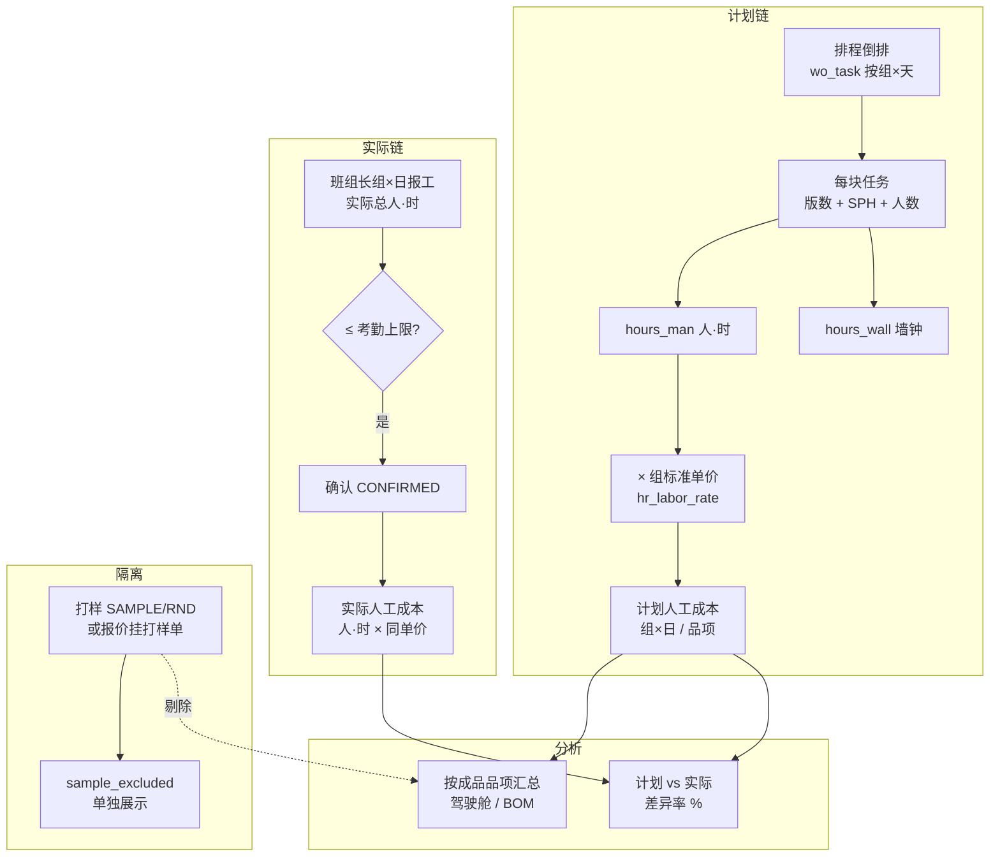

# 斯芬克斯成本核算 · 客户网页演示脚本（交给 Workbuddy）

> **用途**：交给 Workbuddy 生成**中文互动 HTML**，向客户说明 POC 阶段「生产成本」怎么从排程走到汇总，并用**可手算的算例**演示公式。  
> **定位**：一期重点是 **计划人工成本** + **组×日实际报工对比**；不是金蝶式全成本结转、不含料费与制造费用分摊。

---

## 一、给 Workbuddy 的总任务说明（复制段）

请生成一个**单页或分步网页**，面向 **PMC / 班组长 / 财务旁听 / 管理层**，要求：

| 项 | 要求 |
|---|---|
| 形态 | 6~8 步向导 + 「展开算例计算器」动画（数字逐步代入公式） |
| 视觉 | 左侧公式/旁白，右侧流水线：排程任务块 → 人·时 → 单价 → 成本；底部对比「计划 vs 实际」条形图 |
| 交互 | 下一步；可选自动播放；算例 B 可点「+1 步」看乘法展开 |
| 数据 | 使用下文**固定数字与单价**，勿编造 ERP 科目 |
| 必须强调 | **墙钟工时**排产能、**人·时**算成本；两者不可混用 |
| 必须强调 | 量产品项成本 **剔除打样/研发**；打样单独列示 |
| 禁止 | 不写「系统自动结转实际成本到金蝶」；不写「料工费完整标准成本」；不写 OEE/水电/折旧已纳入 |

技术栈不限；需打印友好；移动端可读。

---

## 二、30 秒电梯演讲（Hero）

**标题**：排程算出来的，就是计划人工成本  

**副标题**：任务人·时 × 组标准单价 → 部门汇总 → 报工确认 → 看差异  

**三枚标签**：`人·时计价` · `组×日颗粒` · `打样不进量产`

**脚注**：POC 口径 = **计划人工成本**为主；实际来自班组长**组×日**确认报工，**不是**薪酬发薪系统。

---

## 三、成本逻辑总览（一张图）



**旁白**：  
「我们先从排程里每一格任务算出**要投多少人·时**，再乘以人事维护的**这组标准单价**，得到**计划人工成本**。车间报工后，用同一单价看**实际人·时**花多少，差异率帮助班长和财务看效率，而不是代替工资结算。」

---

## 四、核心公式（页面常驻公式卡）

### 4.1 从排程到单条任务

| 符号 | 含义 | 规则 |
|---|---|---|
| `qty_board` | 当日该任务版数 | 排程倒排产出 |
| `group_rate` | 版/小时 | 来自 SPH + 换算到「版」；CREW 口径不再乘人数 |
| `crew_plan` | 计划投入人数 | 任务上的人数字段 |
| `hours_wall` | 墙钟工时 | `qty_board ÷ group_rate`（排日程、看 E4 产能） |
| `hours_man` | 人·时 | **`hours_wall × crew_plan`**（**算成本只用这个**） |

**动画建议**：同一条任务分两列输出，左列「墙钟 8h」挂到日历格，右列「人·时 24h」飞入成本池。

### 4.2 成本金额

```
计划成本(元) = hours_man × rate_per_man_hour
```

- 单价按 **`schedule_dept + group_code`** 取最新生效 `hr_labor_rate`（演示数据见下表）。
- 金额保留 **2 位小数**（四舍五入）。

**演示单价表（与 seed/demo_data.json 一致）**

| 部门 | 组 | 展示名 | 标准单价（元/人·时） |
|---|---|---|---|
| FINISHED_DEPT | MANUAL | 一部·手工组 | **48** |
| FINISHED_DEPT | MOLD | 一部·模具组 | **62** |
| FINISHED_DEPT | POURING | 一部·浇注组 | **55** |
| SEMI_DEPT | MANUAL | 二部·手工组 | **46** |
| SEMI_DEPT | MOLD | 二部·模具组 | **58** |
| SEMI_DEPT | POURING | 二部·浇注组 | **52** |

### 4.3 汇总层级

| 层级 | 聚合方式 | 系统入口（示意） |
|---|---|---|
| 任务 | 单条 `wo_task` | 看板格子详情 |
| 组×日 | Σ 同计划版本、同组、同日 `hours_man` | 生产成本页、报工 |
| 部门-组 | 日期范围内 Σ | `/modules/hr/labor-cost` |
| 成品品项 | Σ 任务人·时，按订单 **成品 item_code** | 驾驶舱 Top、BOM 计划成本 API |
| 差异率 | `(实际人·时 − 计划人·时) ÷ 计划人·时 × 100%` | 汇总卡片 |

### 4.4 报工约束（会议关注点）

**旁白**：「报工填的是**组×日实际总人·时**，系统校验**不能超过当日考勤上限**（实到人数 × 日工时），防止虚报 —— 与会议要求的报工/考勤联动一致。」

---

## 五、算例 A —— 单格任务（手算入门，60 秒）

**场景**：量产订单 **SO-MASS-1** · 成品 **P1** · 一部 **手工组** · 某日一次排完 **10 版**。

**已知（与自动化测试用例一致）**：

- `hours_wall = 8` h（墙钟）
- `crew_plan = 3` 人
- `hours_man = 8 × 3 = **24**` 人·时
- 单价 `rate = **48**` 元/人·时（一部·手工组）

**分步动画脚本**

| 步 | 屏幕 | 旁白 |
|:---:|---|---|
| A1 | 看板一格：P1 · 10 版 | 「排程落位后，这一格就是一条 wo_task。」 |
| A2 | 公式：墙钟 8h | 「墙钟决定这一天占多少产能，用于排产和 E4。」 |
| A3 | 公式：8 × 3 = 24 人·时 | 「成本按人头放大：三人同时干，人·时是墙钟的三倍。」 |
| A4 | 公式：24 × 48 = **1152.00 元** | 「计划人工成本 1152 元，进入该组当日的计划池。」 |

**字卡**

```
hours_man = hours_wall × crew_plan = 8 × 3 = 24
cost_planned = 24 × 48 = ¥1,152.00
```

---

## 六、算例 B —— 跨组订单（P2：模具 + 二部半成品）

**场景**：**SO-002** · **P2** · 200 盒 · 交期 10/7（正常可排场景）。  
成品在 **一部·模具组** 多日分摊；半成品 **S2** 在 **二部·模具组**（演示用 **282 版** 集中某日，与种子说明一致）。

**讲解要点（不必逐日加总，用「两笔代表任务」）**

| 任务 | 组 | 示意 hours_man | 单价 | 示意计划成本 |
|---|---|---:|---:|---:|
| 成品 P2 某日 | 一部·模具 | 12.0 | 62 | **744.00** |
| 半成品 S2 某日 | 二部·模具 | 18.0 | 58 | **1044.00** |

**分镜**

| 镜号 | 画面 | 旁白 |
|:---:|---|---|
| B1 | 两条产线并行 | 「P2 成本 = 模具组人·时 + 二部胚的人·时，按任务分别计价再相加。」 |
| B2 | 箭头：S2 成本不 backflush 挤进 P2 | 「POC **不做**半成品标准倒挤；每条任务真实人·时累加，避免掩盖浪费。」 |
| B3 | 订单交付故事条：墙钟 vs 人工 | 「销售看交期用排程；财务看效率用人·时成本。」 |

**字卡**

```
订单 SO-002 计划人工成本 ≈ Σ(各 wo_task.hours_man × 该组单价)
（多天一格，逐格相加；演示只展示两格代表）
```

---

## 七、算例 C —— 计划 vs 实际（组×日）

**场景**：一部·手工组 · **2026-09-25** · 已发布计划版本 v1。

| 项 | 数值 |
|---|---:|
| 计划人·时（Σ 当日任务） | **24.0** |
| 班组长报工实际人·时 | **26.0** |
| 单价 | **48** |
| 计划成本 | 24 × 48 = **1152.00** |
| 实际成本（确认后） | 26 × 48 = **1248.00** |
| 差异率 | (26−24)/24 ≈ **+8.3%** |

**分镜**

| 镜号 | 画面 | 旁白 |
|:---:|---|---|
| C1 | 左计划柱 1152 / 右实际柱 1248 | 「同一天、同一组，计划来自排程，实际来自报工确认。」 |
| C2 | 考勤上限虚线 | 「若报工 30 人·时但考勤只允许 28，系统拒绝 —— 先对齐出勤再报。」 |
| C3 | 状态：DRAFT → CONFIRMED | 「确认后才计入实际成本列，避免草稿污染报表。」 |

---

## 八、算例 D —— 量产 vs 打样隔离（Wave X-B）

**场景**：同一品项 **P1**，两单同时有任务：

| 订单 | 性质 | hours_man | 是否进入「量产品项 P1」 |
|---|---|---:|---|
| SO-MASS-1 | 量产 MIS | **24** | ✅ 计入 |
| SO-SMP-1 | 打样 SAMPLE（或报价挂打样单） | **10** | ❌ 剔除 |

**汇总结果（与测试断言一致）**

```
量产品项 P1：hours_man_planned = 24  →  cost = 24 × 48 = ¥1,152.00
sample_excluded：hours_man = 10       →  单独展示，不进 Top 品项
说明文案：「量产成品人·时×标准单价；打样/研发工时已剔除，不摊进品项」
```

**分镜**

| 镜号 | 画面 | 旁白 |
|:---:|---|---|
| D1 | 两列流量，打样流被挡在品项外 | 「打样是为将来量产服务，费用进项目/部门，不污染量产品项单位成本。」 |
| D2 | 驾驶舱 Top 只显示 24h | 「老板看量产品项效率，不会被打样试制拉高。」 |

---

## 九、算例 E —— 按品项汇总（驾驶舱 / BOM）

**旁白脚本**  
「财务或销售在 BOM 页选成品 **P2**，系统在当前**已发布计划版本**下，把所有**量产订单**里 P2 相关任务的 `hours_man` 加总，再乘以各组单价（任务已带组），得到 **P2 计划人工成本**。若多订单同时排产，是**订单任务加总到品项**，不是单订单除法 —— 除非接口额外给 `hint_per_order` 仅供参考。」

**迷你算例（两单量产 P1）**

| 订单 | 示意 plan 成本 |
|---|---:|
| SO-001 任务合计 | 800 |
| SO-101 任务合计 | 600 |
| **品项 P1 合计** | **1400** |

动画：两个订单块汇入「P1 成本池」。

---

## 十、网页信息架构（站点地图）

1. **Hero** — 三句话价值 + 非薪酬脚注  
2. **两种工时** — 墙钟 vs 人·时（对比动画）  
3. **公式链** — 4.1 ~ 4.3 交互计算器（可改 crew / hours_wall 看成本变）  
4. **算例 A** — 1152 手算  
5. **算例 B** — P2 跨组  
6. **算例 C** — 计划 vs 实际 + 考勤上限  
7. **算例 D** — 打样剔除  
8. **算例 E** — 品项汇总  
9. **边界说明** — 一期不含 / 二期待客户清单（见 §十一）  
10. **术语表** — 人·时、标准单价、plan_version、CONFIRMED  

---

## 十一、一期边界（页脚「诚实框」必显）

**本期 POC 已做**

- 排程任务 → `hours_man` → 计划人工成本  
- 组×日 / 部门-组 / 品项汇总  
- 报工实际 vs 计划、差异率  
- 打样/研发工时剔除（`sample_excluded`）  

**本期未做（需对客户说清楚）**

- 原材料、包材、半成品 **库存金额** 结转  
- 标准 backflush、实际成本滚算、金蝶自动凭证  
- 工序 × 工作中心 二维报工（目标是 MES 二期）  
- OEE、水电、折旧分摊进制造费用  
- 项目 ROI 全页（打样费用仅隔离展示）  

**会后客户方向（一句话）**  
「成本看板先帮你们看清 **人工计划 vs 人工实际**；等标准工序清单定了，再把报工升维到工序，料费与制造费用跟 Wave 后续对齐。」

---

## 十二、旁白全集（可 TTS）

**开场**  
「斯芬克斯 POC 的成本模块，回答两个问题：这单排程**计划要花多少人·时多少钱**，以及班组**实际报工有没有超计划**。核心是排程里的任务，不是事后再估。」

**双工时**  
「排程看墙钟，避免一组一天塞爆；成本看人·时，因为三个人干八小时，占的是二十四人·时的成本。混用会把产能和工资口径搅在一起。」

**单价**  
「每组一个标准人时单价，由人事维护，可按生效日调整。计划与实际用**同一单价**，差异来自**工时**，不是来自随意改价。」

**打样**  
「打样和研发工时单独统计，不进入量产品项 Top，避免试制把量产成本线抬歪。」

**收尾**  
「这是透明、可追的计划人工成本链路。正式上线后，单价与考勤来自真实主数据，公式与演示一致。」

---

## 十三、与真实系统对齐（实施自检）

| 演示内容 | 本地验证 |
|---|---|
| 算例 A/D 数字 | `tests/test_product_labor_cost.py` |
| 生产成本汇总页 | `/modules/hr/labor-cost` |
| 组×日报工 | `/modules/production/time-report` |
| 品项计划成本 | BOM Explorer · `/api/hr/labor-cost/product/{item}` |
| 单价种子 | `seed/demo_data.json` → `labor_rates` |
| 打样隔离说明 | `客户会议反馈/工艺口径与量产成本隔离-升级方案.md` |

---

## 十四、Workbuddy 一键 Prompt

```
请根据附件《成本核算-网页演示-Workbuddy脚本.md》全文，生成中文互动 HTML 演示：
- 6~8 步 + 算例 A~E（手算 1152、P2 跨组、计划vs实际、打样剔除、品项汇总）
- 强调 hours_wall 与 hours_man 分离；成本 = hours_man × 组标准单价
- 使用文档中的单价 48/62/55/46/58/52，勿编造全成本或 ERP 结转
- 页脚展示「一期边界」诚实框
交付：单页 HTML 或轻量 React 均可，适合展会大屏与手机浏览。
```

---

*文档版本：与 `shared/labor_math.py`、`db/product_labor_cost.py`、`db/labor_cost_queries.py`、Wave X-B 口径同步。*
