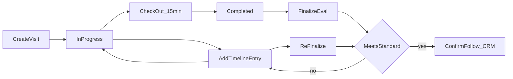

# 拜访签到 · 升级方案

> **2026-09-24。** 出处：演示线现场反馈 **FB-001**（run `8bb50e80-d4c6-482b-831f-6ffc30f1cdd3`，环节 `visit_stranger`，导出 `演示过程 · 20260924-181450`）。  
> 与 [演示线-升级方案.md](演示线-升级方案.md) 第 4 步「陌生拜访」、 [CRM电脑端-低代码菜单对照.md](CRM电脑端-低代码菜单对照.md)「拜访签到」、 [CRM销售移动端-优化方案.md](CRM销售移动端-优化方案.md)「销售移动端 / 系统配置」并列；**双端共用一套外勤模型**。  
> **约束**：禁止写回 `so_order.due_date`（BR-27）。线索「有效跟进」判定不重写，仍见电脑端菜单对照 §「什么叫有效跟进」（已确认 + 签到到签退满 15 分钟，代码 `visit_is_valid` / `VALID_MINUTES`）。

---

## 1. 为什么要做

演示线第 4 步已能写入 5 条 GD 外勤，但客户对 **拜访签到页的设计** 提出整页级优化（严重度：会后优化，非演示阻断）。核心诉求：

1. **新建拜访 = 拜访已开始**：创建时刻即开始时间；销售跑的客户不一定是库内老客户。
2. **列表可读性**：展示拜访开始时间、**当前持续时长（分钟）**；客户列支持库内关联或手填名称。
3. **详情可追加**：离店后仍能 **持续添加拜访记录**，以 **时间线** 展示（销售常在离开现场后才整理信息）。
4. **结案与达标**：提交后需 **归纳总结 + 进展标签**（如接触到决策人、挖掘到商机）；列表增加 **是否达标** 列（POC 粗规则：无任何拜访成果则不达标）；详情 **大图标** 展示达标状态；不达标可通过补录变达标。
5. **页顶统计**：不达标拜访数、各进展标签下的拜访数，并可筛选列表。

当前 POC 是「待签到 → 签到 → 满 15 分钟签退 → 单文本框 → 规则整理 → 确认写入跟进」，与上述 **长时间在场、分段补记、再评估达标** 的动线不一致；移动端已有 LLM 草稿能力，电脑端 `/parse` 仍为规则整理，双端未统一。

---

## 2. 设计原则

1. **双端一模型**：电脑 [`/crm/checkin`](../web/src/modules/crm/CrmExtendedPages.tsx)（`CheckinPage`）与销售移动端 [`/crm/visit`](../web/src/modules/crm/VisitPage.tsx) 共用同一组 API 与字段；仅布局不同（侧栏抽屉 vs 全屏），禁止第二套状态机。
2. **有效跟进不重定义**：写入 CRM 跟进、线索回收起算仍沿用「已确认 + 签退满 15 分钟」；本方案新增「达标 / 进展标签」用于 **拜访管理与看板**，与有效跟进可重叠但不替代。
3. **LLM 可关、可降级**：P1–P3 仅用 **规则引擎** 可演示、可测；**P4 专章** 接入大模型；未配置密钥或调用失败时降级为 P2 规则（与移动端 `build_draft` 的 `llm → keyword` 一致）。
4. **演示锚日**：列表时长、统计 API 接受 `today` / 演示 `now`（与 `DEMO_ANCHOR_TODAY = 2026-09-15` 一致），避免墙钟与演示日错位。
5. **不写客户交期**：归纳与 Prompt 禁止建议改写订单交期或 `so_order.due_date`。

---

## 3. 现状与差距

| 维度 | 现状（代码） | 目标 |
|------|----------------|------|
| 新建 | `create_field_visit` → 状态「待签到」，无 `check_in_at` | 创建即 `started_at`，状态「进行中」 |
| 客户 | 可空 `customer_code`，手填 `customer_name`；新建默认「老客户拜访」 | 默认「陌生客户拜访」；列表展示库内名或手填名 |
| 记录 | 单字段 `situation_note` + PATCH | 子表 `crm_field_visit_log` 时间线，多条追加 |
| 列表列 | 编码、标题、客户、状态、操作 | + 开始时间、持续分钟、标签摘要、是否达标 |
| 整理 | 电脑 `parse_situation_note` 规则；移动 `_llm_draft` | P2 规则 finalize；P4 LLM finalize，字段形状不变 |
| 统计 | 无 | 页顶不达标数、按标签计数、筛选 |
| 演示 seed | 第 4 步 5 条 WF/GD 外勤，无时间线/达标样例 | P2 起 seed 含时间线与 mixed 达标 |

---

## 4. 交互与字段

### 4.1 状态机（共用）



- **进行中**：可追加时间线条目；可签退（仍须满 15 分钟，沿用 `VALID_MINUTES`）。
- **已完成**：已签退，可继续追加条目并 **重新评估**（`finalize`），直至达标或销售确认写入跟进。
- **已确认**：已 `confirm_field_visit_follow`，不可再改条目（与现网一致）。

### 4.2 列表（双端）

| 列 | 说明 |
|----|------|
| 编码 | `WF*` 或 `GD-*-V*` |
| 标题 | 外勤标题 |
| 客户 | `customer_name` 或库内客户名；无则「—」 |
| 开始时间 | `started_at`（ISO，展示到分钟） |
| 持续 | 进行中：`now - started_at`；已结束：签退间隔 |
| 进展 | `progress_tags` 摘要（最多展示 2 个 + …） |
| 达标 | 是 / 否（`meets_standard`） |
| 状态 | 进行中 / 已完成 / 已确认 |
| 操作 | 签退、打开详情 |

页顶：**不达标 N**、各标签 Chip（点击筛选 `tag=`）。

### 4.3 详情（双端）

- **大图标区**：达标（绿）/ 不达标（ amber ）+ `standard_reason` 一行说明。
- **时间线**：按 `recorded_at` 降序或升序（默认升序）；每条「添加记录」写入 `crm_field_visit_log`。
- **签退 / 归纳 / 写入跟进**：签退后显示「归纳拜访成果」；达标后启用「确认写入跟进」（复用现有匹配客户/线索/商机逻辑）。

---

## 5. 达标与进展标签（POC）

### 5.1 进展标签枚举（P2 规则可识别）

| 标签 | 含义（POC） |
|------|-------------|
| `关系建联` | 有实质沟通内容，无决策人/商机信号 |
| `触达决策人` | 正文含决策人/负责人/总监等 |
| `挖掘到商机` | 含采购/意向/打样/报价/数量等商机信号 |
| `仅信息收集` | 有内容但偏寒暄、无上述信号 |
| `无成果` | 时间线合计为空或仅占位 |

### 5.2 达标规则（P2，无 LLM）

**达标**当且仅当满足其一：

- 至少 1 条时间线 `body` 非空且长度 ≥ 4（去掉空白）**且** 规则打出的标签不是仅 `无成果`；
- 或标签含 `触达决策人` / `挖掘到商机`。

**不达标**：无时间线条目，或仅有空内容，或仅 `无成果`。

签退 **不要求** 达标；**写入跟进** 建议要求达标或销售显式确认「仍要写入」（POC 可先软提示）。

### 5.3 与「有效跟进」（线索回收）

有效跟进仍为：外勤 **已确认** + `visit_is_valid(check_in, check_out)`。  
`meets_standard` 用于拜访管理看板，**不替代** 15 分钟规则。

---

## 6. API 草案

基路径：`/api/crm/checkin`（现有路由扩展；静态路径 `stats` 须注册在 `{code}` 之前，避免路由遮蔽）。

| 方法 | 路径 | 说明 |
|------|------|------|
| GET | `/api/crm/checkin?today=` | 列表（增字段：`started_at`, `elapsed_minutes`, `progress_tags`, `meets_standard`） |
| GET | `/api/crm/checkin/stats?today=` | `{ not_meeting: n, by_tag: { 标签: n } }` |
| POST | `/api/crm/checkin` | 新建即开始（写 `started_at` / `check_in_at`） |
| GET | `/api/crm/checkin/{code}` | 详情 + `timeline: [...]` |
| POST | `/api/crm/checkin/{code}/logs` | 追加时间线条目 |
| POST | `/api/crm/checkin/{code}/sign-in` | 兼容旧流；P1 后可 deprecated 或 no-op 若已进行中 |
| POST | `/api/crm/checkin/{code}/sign-out` | 签退（15 分钟） |
| POST | `/api/crm/checkin/{code}/finalize?today=` | P2：规则评估；P4：LLM 优先 + 降级 |
| POST | `/api/crm/checkin/{code}/parse` | 保留；P4 与 finalize 对齐或合并 |
| POST | `/api/crm/checkin/{code}/confirm-follow` | 现有，输入改为 summary + tags |

LLM 配置（已有）：`GET/PUT /api/crm/llm-config`（[`db/crm_sales.py`](../db/crm_sales.py)）。

---

## 7. 数据模型

### 7.1 主表 `crm_field_visit`（扩列）

| 列 | 类型 | 说明 |
|----|------|------|
| `started_at` | datetime | 拜访开始（新建即写） |
| `finalized_at` | datetime nullable | 最近一次归纳时间 |
| `summary` | text | 归纳摘要 |
| `progress_tags_json` | text | JSON 数组字符串 |
| `meets_standard` | bool nullable | 是否达标 |
| `eval_source` | string | `rule` / `llm` / `keyword` |
| `standard_reason` | string | 不达标原因文案 |

兼容：保留 `check_in_at` / `check_out_at` / `situation_note`；迁移时可将 `situation_note` 复制为首条 log。

### 7.2 子表 `crm_field_visit_log`（新）

| 列 | 说明 |
|----|------|
| `id` | PK |
| `visit_code` | FK → `crm_field_visit.code` |
| `recorded_at` | 记录时刻（默认演示 now） |
| `body` | 正文 |
| `created_by` | 销售显示名 |

---

## 8. 分期交付（P1–P4）

| 阶段 | 名称 | 交付内容 | 主要文件 |
|------|------|----------|----------|
| **P1** | 外勤时间线骨架 | 子表 + migrate；创建即开始；列表开始/时长；详情时间线 CRUD；双端读同一 API | `db/tables.py`, `db/migrate.py`, `db/crm_field_visit.py`, `apps/api/routers/crm.py`, `CrmExtendedPages.tsx`, `VisitPage.tsx` |
| **P2** | 达标与看板 | 规则 `meets_standard` + `progress_tags`；列表达标列；详情大图标；`GET .../stats`；演示线第 4 步 seed 含时间线/ mixed 达标 | + `db/guided_demo_step_apply.py`, `tests/test_guided_demo_visit_apply.py` |
| **P3** | 结案与 CRM 挂接 | `finalize` → `confirm_field_visit_follow`；归纳写入跟进；与线索有效跟进测试对齐 | `tests/test_crm_field_visit.py`, `tests/test_crm_visit_lead_link.py` |
| **P4** | **大模型自动识别** | 见 §9；**不改** P2 定死的 JSON 字段形状 | `db/crm_sales.py`（抽取 `visit_finalize_llm`）, 系统配置 UI |

**P4 与 P2 契约**：`summary`, `progress_tags`, `meets_standard`, `eval_source` 在 P2 定稿；P4 只替换评估实现。

---

## 9. P4 · 大模型自动识别（独立阶段）

### 9.1 何时调用

- 销售在详情点击 **「归纳拜访成果」**（`POST .../finalize`）时；
- 可选：签退成功后自动触发一次 finalize（可配置，默认手动）。

### 9.2 配置

- 与移动端相同：`crm_llm_base_url` / `crm_llm_api_key` / `crm_llm_model`（[`SettingsPage`](../web/src/modules/settings/SettingsPage.tsx) / 总经理维护）。
- 无密钥：**不调用** 外网，走 P2 规则，`eval_source=rule`。

### 9.3 输入

- 拼接该外勤全部 `crm_field_visit_log.body`（按时间序）+ 元数据：`customer_name`, `visit_kind`, `today`（演示锚日）。
- 可选：当前销售可见客户名列表（与 `_llm_draft` 相同，上限 30 条）。

### 9.4 Prompt 输出（JSON only）

字段：

- `summary`：string，3–5 句归纳；
- `progress_tags`：string[]，取自 §5.1 枚举；
- `outcome`：兼容移动端的 `关系建联|触达决策人|挖到商机`；
- `meets_standard`：boolean；
- `opportunity_hint`：optional，仅 `挖掘到商机` 时填名称草稿；
- **禁止** 输出交期、禁止建议修改 `due_date`。

### 9.5 降级

1. LLM 超时 / 非 JSON / 缺字段 → 调用 P2 规则函数， `eval_source=keyword` 或 `rule`；
2. UI 展示 `eval_source` 小字（「规则归纳」/「模型归纳」），便于演示说明。

### 9.6 验收（P4）

- 配置 DeepSeek（或兼容 OpenAI API）后，finalize 返回 `eval_source=llm` 且 tags 与正文语义一致；
- 关密钥后同一条外勤 finalize 仍成功且 `eval_source=rule`；
- pytest：mock HTTP，不测真外网。

---

## 10. 双端对齐

| 能力 | 电脑 `/crm/checkin` | 移动 `/crm/visit` |
|------|---------------------|-------------------|
| 新建外勤 | 「新建外勤」弹窗 | 今日流 / 客户流新建 |
| 时间线 | 侧栏 `SideDrawer` | 全屏详情 |
| 列表统计 | P2 页顶 Chip | P2 与「拜访完整度」指标挂钩（见移动方案） |
| AI | P4 前：规则 finalize；P4 后：与移动共用 LLM | 已有 `build_draft` / `_llm_draft` |
| 15 分钟签退 | 同 | 同 |

---

## 11. 演示线第 4 步 seed（P2 起）

- 5 条 GD 外勤：至少 3 条 **已达标**（含 2+ 条时间线 + 标签），1 条 **不达标**（空时间线），1 条 **进行中**（可演示签退）。
- 关联本批 `GD-*-C01…` 客户；陌拜样例 1 条可无 `customer_code`、仅手填公司名。

---

## 12. 测试清单

| 测试 | 阶段 |
|------|------|
| 创建即开始、`elapsed_minutes` | P1 |
| 追加 log、列表 timeline | P1 |
| 规则 finalize、meets_standard、stats | P2 |
| confirm-follow 与 15 分钟 | P3 |
| LLM finalize mock + 降级 | P4 |
| `GET /checkin/stats` 路由不遮蔽 | P2 |
| `test_guided_demo_visit_apply` seed 字段 | P2 |

---

## 13. 交叉引用

- [CRM电脑端-低代码菜单对照.md](CRM电脑端-低代码菜单对照.md) — 拜访签到菜单、有效跟进
- [CRM销售移动端-优化方案.md](CRM销售移动端-优化方案.md) — 系统配置、拜访完整度
- [CRM包B五项收尾-升级方案.md](CRM包B五项收尾-升级方案.md) — 拜访 draft / confirm
- [演示线-升级方案.md](演示线-升级方案.md) — 第 4 步陌生拜访
- [第二次演示后-完整升级方案.md](第二次演示后-完整升级方案.md) — 包 B 销售

---

## 14. 待解析员（假设，未确认）

- 出处：`demo_run/8bb50e80-d4c6-482b-831f-6ffc30f1cdd3`，FB-001。
- 建议假设链：运营 · 外勤拜访时间线 → 拜访成果达标 → 进展标签（枚举 §5.1）→ 双端共用 API。
- 客户点头后再 `harvest-check --确认`；禁止未确认升格封印。

---

## 15. 待工匠 Ticket（模板）

复制以下块开 P1/P2/P3/P4 Ticket（每阶段一张）：

```markdown
### Ticket · 拜访签到 · P?

- **事实编号**：FB-001 / 拜访签到-升级方案 §8 P?
- **绑定对象**：crm_field_visit、crm_field_visit_log、crm_follow_record、crm_lead（有效跟进）
- **禁止项**：禁止写回 so_order.due_date（BR-27）；禁止改 packages/engine/ 排程；P4 前禁止强依赖外网 LLM（须可降级）
- **将改文件**：
  - db/tables.py, db/migrate.py, db/crm_field_visit.py
  - apps/api/routers/crm.py（checkin 路由顺序：stats/logs 先于 {code}）
  - web/src/modules/crm/CrmExtendedPages.tsx, VisitPage.tsx
  - （P2）db/guided_demo_step_apply.py
  - （P4）db/crm_sales.py 抽取 visit_finalize_llm
- **验收**：pytest -q tests/test_crm_field_visit.py tests/test_guided_demo_visit_apply.py [tests/test_crm_visit_lead_link.py] [test_llm_finalize mock]
- **KB**：新表/新 API 挂 kb/coverage.yaml（假设卡由解析员交付）
```

---

## 16. 明确不交付

- 计件发薪 / 算薪 Excel 导入（将来输入，见演示线方案 §7）。
- 金蝶 / 企微聊天自动摘取拜访内容。
- 用达标规则替代 15 分钟有效跟进判定。
- 正排 / 全量重排 / 写回客户订单交期。
