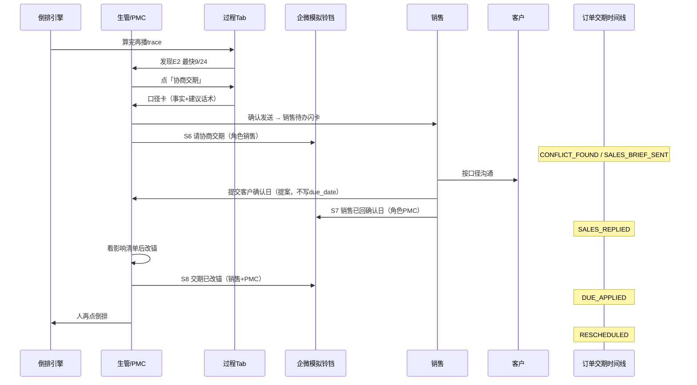

# 排程辅助调整与交期协商 · 升级方案

> 2026-09-16 会后讨论沉淀。客户期待的不是全手工拖格子，也不是 APS 自动最优，而是 **系统出方案、人点确认**，并把车间红灯接到销售改口、全程留痕。  
> 本方案与会议升级总计划并行：不替代 Wave 3（二部拆组）/ Wave 4（设备+关键岗额度）/ [Wave X（工艺口径与量产成本隔离）](工艺口径与量产成本隔离-升级方案.md)，先补「红了之后人怎么协作」。

---

## 1. 为什么要做

### 1.1 客户看到的现状

看板右侧冲突面板对 SO-004（P2，交期 9/22）直接亮红：

- **E1**：未在最早可排日前安置完
- **E2**：半成品来不及；系统最快可完成 **9/24**
- 绿字建议「最快可完成日 2026-09-24，建议与销售协商交期」

生管会问：**系统有没有尝试过调整？**

### 1.2 引擎实际做了什么（必须对客户说清楚）

红条 **不是**「调完还不行」，而是 **这一轮倒排已经顶到物理边界**，停手并给出最快可完成日。

系统 **已经做的**（一次 `schedule()`）：

1. 从订单交期往回填（JIT 倒排，BR-20）
2. 非工作日跳过，组×日容量满了把剩版推到前一个工作日
3. 先排成品，再排半成品（BR-34）；半成品须赶在成品开工前
4. 撞上最早可排日 `max(today, 齐套日)` 仍有余量 → 停，记 E1（BR-21）
5. 半成品仍赶不上成品开工 → 记 E2（BR-35）
6. 另算最快可完成日（BR-47），**不写回** `so_order.due_date`（BR-27）
7. 冲突全部软提示，不阻断排产（BR-50）

系统 **没有做的**：

- 没有自动改交期、加班、拆冻结区
- 没有为救这一单去重排别的单
- 没有跑插单四策略（A/B/C/D）——那套只挂在「新插一张紧急单」
- 没有第二次优化把红变绿

右侧 `suggest`（`EARLIEST:` / `DELAY_1D` / `ADD_CREW` / `NOTIFY_SALES`）目前 **只是文案**，点不了。

### 1.3 客户真正要买的

现场节奏是：**按交期拎单 → 系统先算 → 人再调**。他们要的是辅助调整，不是客服聊天，也不是电脑替他们答应客户。

价值闭环：

| 角色 | 现在 | 升级后 |
|------|------|--------|
| 生管 / PMC | 看见红，自己组织语言找销售 | 点策略卡，系统写好口径，一键发给销售 |
| 销售 | 只听到「排不了」 | 拿到可对外说的事实：原交期 / 卡在哪 / 最快哪天 |
| 客户 / 验收 | 看不懂倒排 | 过程 Tab 回放「正在倒排 SO-004…发现冲突」 |
| 事后质检 / 外接模型 | 没有结构化过程 | 同一份运行日志 + 订单交期时间线可核对 |

---

## 2. 设计原则（讨论结论，违反即重写）

1. **提出 + 确认，不自动落库。** 红了不出第二套求解器，不出遗传/LP。复用现有 `schedule()` / what-if / `diff`。
2. **聊天是回放层，不是第二套引擎。** 倒排仍一次算完再播。气泡对齐 `ScheduleTrace.events`，禁止模型现场编步骤，禁止假装还在算。
3. **日志是事实源，聊天气泡是投影。** 每条气泡带 `run_id` + `event_id`。外接大模型只吃 `sphinx.schedule_run_log.v1` 的 `llm_brief`，不从 UI 文案反推。
4. **交期只有人能改（BR-27）。** 销售「发送」= 回传客户确认日（提案）；只有 PMC/GM 走变更审批 / `update_order_due_date_by_user` 才写库。引擎与辅助策略 **零次** 写 `so_order.due_date`。
5. **改锚后也不默认全量重排（BR-40）。** PMC 确认新交期后，人再点一次倒排；时间栅栏 + 涟漪上限仍在。
6. **一期不做自由提问的 LLM 对话框。** 系统说、人点卡。模型只做事后质检（或侧栏「检查本轮」读同一份 log）。生管一问「能不能周五交」，模型容易随口改交期。
7. **加班/加人策略以后必须与 Wave 4 同一套额度。** 否则销售绿灯、车间一排又红。本期加班卡可以出 what-if，落地应用标「需班组长确认临时工时」。
8. **PMC↔销售的每一步都同步企微模拟。** 顶栏铃铛 [`WecomBell`](web/src/components/WecomBell.tsx) 与待办、订单时间线三处同一事件，禁止只写待办不写铃铛。**真企微机器人推送不在 POC**（与现有 S1–S5 一样走本地 `wecom_message`）；正式系统再换 adapter 推到销售企微。

规格原文（§6.6）已写过三个按钮：**通知销售 / 申请加班 / 仍按原交期排（需填原因）**。本方案把它做成可演示的协作流，而不是三个死文案。

---

## 3. 产品形态

### 3.1 冲突区改为两个 Tab

右侧现有 [`ConflictPanel`](web/src/components/ConflictPanel.tsx) 拆成：

| Tab | 给谁 | 做什么 |
|-----|------|--------|
| **清单** | 熟手扫全场 | 保持现状：红/黄/灰/蓝、按订单分组、点格定位 |
| **过程** | 讲解 + 处置 | 本轮怎么排的、红在哪一步冒出来、策略卡片、确认后的协作状态 |

看板上方「试排后讲解回放 / 回放刚才的倒排」可以后并：过程 Tab 默认播同一份 `lastTrace`，并同步点亮左侧格子。避免两处各讲一套。

### 3.2 过程 Tab 的叙事节奏（短，可展开）

默认折叠，对接现有 [`NarrationBar`](web/src/components/NarrationBar.tsx) / `ScheduleTrace`：

1. 开始排产 · 策略 `DUE_DESC` · 池内 N 单
2. 队列摘要（晚交期先占格）
3. 每张单一句落位结论（可点开展开逐步：跳过休息日、当日吃几版）
4. 红单展开：撞 earliest → **发现冲突 E1/E2**
5. **策略卡片**（人点）

文案示例（投影自 trace，不是模型生成）：

> 开始排产。按交期降序取单。  
> 正在倒排 **SO-004**（P2，交期 9/22）……从 9/22 往回填。  
> 半成品须赶在成品开工前。撞上最早可排日，仍有余版。  
> **发现冲突 E2**：订单要求 9/22，系统最快 9/24。

需要讲课再「展开逐步」，进度与左侧格子脉冲同步（现有 `replayIndex` / `conflictPulse`）。

### 3.3 策略卡片（过程 Tab 的主产出）

点一条 E1/E2，系统在内存里并行试最多三档，出 `diff`，人勾一档：

| 卡 | 系统做什么 | 人确认之后 |
|----|------------|------------|
| **协商交期** | 用最快可完成日做口径卡（见 §4） | **不改交期**；生成给销售的待办 |
| **加班 / 加人** | 复用插单策略 C（组×日临时加工时）再倒排 | 看哪几天、加几小时；班组长认后才应用 |
| **保本单挤别人** | `PIN_FIRST` 钉住本单（插单策略 B） | 看哪些单被提前、会不会新红；确认后才应用 |

三条都试过仍红，才落到「联系销售」——那是算过了，不是没试。  
默认不自动改交期、不加产能、不挤别人。

演示优先做 **协商交期**（SO-004 当场能走完）；加班 / 挤占可第二小步，复用 [`packages/engine/insert.py`](packages/engine/insert.py) 的 A/B/C。

---

## 4. 协商交期闭环（本方案的核心增量）

现有变更单是 **销售先改交期 → PMC 批影响清单**（[`db/order_change_service.py`](db/order_change_service.py)）。现场常见相反：PMC 先发现排不下，要销售去谈；谈完 PMC 才改锚再排。

### 4.1 口径卡（模板，禁止临场编日期）

点「协商交期」自动弹出，字段固定，生管可改两句语气再确认：

- 订单 / 品项 / 客户 / 销售
- 原交期
- 冲突码与一句话原因（E1 未安置 / E2 半成品来不及）
- 最快可完成日（来自 `EARLIEST:` / `unplaced.earliest_finish`）
- 建议话术，例如：

> 我按如下口径回复销售：  
> SO-004 极谊优选礼品（韩毅）P2，客户要 9/22。倒排后半成品提前期不够，**系统最快 9/24**。请与客户确认能否改为不早于 9/24。未确认前计划仍按 9/22 挂红，不改客户交期。

模型以后只允许润色语气，**不能改日期和原因**。日期一律来自当次 `run_log`。

### 4.2 销售待办（要显眼，但只闪该条）

PMC 点确认后：

- 待办中心新增 `kind=DUE_NEGOTIATE`，角色 `SALES` / `SALES_MGR`
- 顶栏 / 门户一条 **高亮卡**（短闪后停，不要所有待办都闪）
- 深链到该订单（订单详情 + 交期时间线 + 回复框）
- **同时写一条企微模拟消息**（见 §4.5），销售顶栏铃铛未读 +1；不要只闪待办、铃铛没动静

### 4.3 销售「发送」= 提案，不写交期

销售谈完，填客户确认日（可与建议 9/24 不同），点发送：

- 状态变为「销售已回 · 待 PMC 改锚」
- **不**调用 `update_order_due_date_by_user`
- PMC 在过程 Tab / 订单详情看到「销售已回 9/25」
- 用现成 [`compute_due_change_impact`](db/order_change_service.py) 看涟漪与是否还红
- PMC/GM 确认后才写 `due_date`，再 **手动** 点倒排

### 4.4 订单交期更新动态时间线（事实账本）

聊天区是投影；**订单级时间线才是交期沟通的事实**。挂在订单详情抽屉（[`OrderDetailDrawer`](web/src/modules/orders/OrderDetailDrawer.tsx)），排程点单也能打开。

事件枚举（建议）：

| 事件 | 谁触发 | 记什么 |
|------|--------|--------|
| `CONFLICT_FOUND` | 倒排结果 | run_id、E1/E2、最快可完成日 |
| `SALES_BRIEF_SENT` | PMC 确认口径卡 | 建议日、话术快照 |
| `SALES_REPLIED` | 销售发送 | 客户确认日、备注 |
| `DUE_APPLIED` | PMC/GM 改锚 | 旧交期 → 新交期、变更单 id |
| `RESCHEDULED` | 人点倒排 | 新 run_id、红是否消除 |
| `ASSIST_TRIAL` / `ASSIST_APPLY` | 加班/挤占试排或应用 | 策略、diff 摘要 |

每条挂 `order_no`、`run_id`、角色、时间。供演示回放，也供外接模型验收「谁改的交期、依据哪次倒排」。时间线事件与企微模拟 **一对一同步**（同一 `change_request_id` / `event_id`），切角色即可在铃铛里看到对方刚走的那一步。

### 4.5 企微模拟通知（POC 必做；真推送留给正式系统）

现有 S1/S3 是 **销售提交变更 → PMC 批**，方向与本方案相反。协商交期要在顶栏「企微模拟」铃铛里 **逐步同步**，和待办、订单时间线共用一次业务动作。

| 场景码 | 何时写入 | 谁看见 | 标题 / 正文要点 | 深链 |
|--------|----------|--------|-----------------|------|
| **S6** `DUE_NEGOTIATE_ASK` | PMC 确认口径卡 | 该单销售、销售总监、GM | 请协商交期 · SO-004；原 9/22，系统最快 9/24；附口径摘要 | 订单详情 / 回复框 |
| **S7** `DUE_NEGOTIATE_REPLY` | 销售点发送（提案） | PMC、GM | 销售已回客户确认日 · SO-004 建议改为 9/24（或销售填写的日期） | 排程过程 Tab / 影响清单 |
| **S8** `DUE_NEGOTIATE_APPLIED` | PMC 改锚成功 | 销售、销售总监、PMC | 交期已改锚 9/22→9/24，请 PMC 再倒排（**不**说系统已自动重排） | `/schedule` |

仍走现有 [`emit_wecom_message`](apps/api/services/flow.py)，**禁止 router 直调**。可加 `on_due_negotiate_ask / reply / applied` 三个入口，与 `on_order_change_submitted` 并列。消息 `body` 用口径卡事实字段，不让模型另写一版。

**POC 边界（对客户要讲清楚）：**

- 演示的是 **站内铃铛 + 未读列表 + 按角色过滤**，与九幕剧本里「企微/日程为本地模拟，非真 SDK」同一口径（[`apps/api/routers/demo.py`](apps/api/routers/demo.py) disclaimer）。
- **做不到、也不做：** 真企微应用、群机器人、把卡片推到销售手机。正式系统把 `emit_wecom_message` 背后换成 adapter（应用消息 / 机器人 webhook），场景码 S6–S8 与深链保持不变，避免演示口径和上线口径两套。
- 日程模拟（现有 S2）可选：S8 之后给 PMC 一条「再倒排 · SO-004」，`idempotency_key` 带 `order_no + new_due`。

验收：切到销售角色，铃铛能看到 S6；回日后再切 PMC，铃铛能看到 S7；改锚后双方都能看到 S8。

---

## 5. 运行日志与外接大模型

已有积木，不要另存一份聊天记录：

- [`packages/engine/run_log.py`](packages/engine/run_log.py) · `schema = sphinx.schedule_run_log.v1`
- `ALGORITHM_CARD` + 输入订单 + `trace` + 冲突 + `llm_brief` + `llm_ask`（五问：顺序、倒排、半成品、红冲突、验收结论）
- `GET /api/schedule/logs/{run_id}?brief=1`

升级要点：

1. 过程气泡 = `trace.events` 的中文投影（`QUEUE` / `PLACE` / `SEMI` / `UNPLACED`）
2. 人点策略卡追加 `ASSIST_TRIAL` / `ASSIST_APPLY` / `SALES_BRIEF_SENT` 到 **同一份** run log（或订单时间线引用 `run_id`）
3. 外接模型的输入永远是 `llm_brief`，不是聊天气泡
4. 一期侧栏最多一个「检查本轮」按钮：把 brief 交给配置的外部模型，回传通过 / 有条件通过 / 不通过；**不**让模型改计划

`llm_ask` 可补两问：6) 协商口径里的日期是否等于当次最快可完成日；7) 交期是否只在审批流被改。

---

## 6. 数据与接口（建议）

在现有表上扩展，避免平行系统。

### 6.1 `order_change_request` 加来源

现有行：销售请求改交期，PMC 批。

增加：

- `source`：`SALES_CHANGE`（现状）| `SCHEDULING_CONFLICT`（本方案）
- `status` 扩展：`PENDING_SALES`（已发口径，等销售回）→ `SALES_REPLIED` → `PENDING_PMC` → `APPROVED` / `REJECTED`
- `suggested_due`（最快可完成日）
- `sales_proposed_due`（客户确认日）
- `brief_text`（口径快照）
- `run_id`（发现冲突的那一轮）

### 6.2 新表 `so_order_due_event`（时间线）

`id / order_no / event_type / actor_role / payload_json / run_id / change_request_id / created_at`

禁止用聊天消息表当账本。

### 6.3 API（示意）

| 方法 | 路径 | 作用 |
|------|------|------|
| GET | `/api/schedule/process?run_id=` | trace → 过程气泡 + 已挂策略状态 |
| POST | `/api/schedule/assist/trial` | 对某 wo/冲突试三档，不落库 |
| POST | `/api/schedule/assist/brief` | PMC 确认口径 → 待办 + 时间线 + **企微 S6** |
| POST | `/api/orders/{no}/due-negotiate/reply` | 销售回确认日（提案）+ **企微 S7** |
| POST | `/api/orders/{no}/due-negotiate/apply` | PMC 改锚（复用变更审批写 due_date）+ **企微 S8** |
| GET | `/api/orders/{no}/due-events` | 交期时间线 |

待办：[`db/todo_center.py`](db/todo_center.py) 增加销售侧 `DUE_NEGOTIATE`。企微只经 [`flow.py`](apps/api/services/flow.py) 发 S6–S8，与未读列表 / 顶栏铃铛同一张 `wecom_message` 表。

---

## 7. 明确不做

- 过程 Tab 做成可自由提问的排程客服
- 销售一点发送就自动改 `due_date` 或自动全量重排
- 红了自动加班、自动挤占、自动改交期
- 第二套正排 / 双向排 / OR-Tools
- 点名到人、完整 EAM（仍属 Wave 4 挂起项）
- 用模型生成「为什么排不下」的日期与原因
- 默认全量重排作为冲突修复
- **真企微 SDK / 群机器人 / 推到销售手机**（一期明确不交付；正式系统换 adapter）

---

## 8. 与现有代码的接法（不另起炉灶）

| 已有 | 本方案怎么用 |
|------|----------------|
| `ScheduleTrace` + 讲解回放 | 过程 Tab 的逐步叙事与格子脉冲 |
| `Conflict.suggest` | 映射到策略卡类型，不再只是文案 |
| `insert.py` 策略 A/B/C/D | 加班=C，保本单=B；协商=D 的「受影响清单」升级为协作流 |
| `/api/schedule/what-if` + `diff` | 策略试排、改锚前影响 |
| `compute_due_change_impact` | 销售回日后 PMC 确认前 |
| `update_order_due_date_by_user` | **仅** PMC/GM 改锚 |
| `run_log` / `llm_brief` | 过程投影 + 外接质检 |
| 待办中心 / 企微铃铛 / `flow.emit_wecom_message` | 协商每一步同步 S6–S8；角色过滤与现有 S1/S3/S5 相同 |
| 整单 CTP | 销售侧绿灯与车间最快可完成日同一口径（改锚后再预检应对齐） |

Wave 4 之后：CTP 与正式排产、加班 what-if 必须吃同一套设备+关键岗上限。

---

## 9. 落地节奏

### A. 过程可见（先能讲清楚）

- 冲突区双 Tab
- 过程 Tab 播现有 trace（折叠摘要 + 可展开逐步）
- 红事件下挂策略卡 **展示**（协商卡可点，加班/挤占可先灰）
- 不接 LLM

### B. 协商交期闭环（客户最有感）

- 口径卡模板
- PMC 确认 → 销售待办高亮卡 **+ 企微模拟 S6**
- 销售回确认日 **+ 企微模拟 S7**（PMC 铃铛）
- PMC 看影响后改锚 **+ 企微模拟 S8**，人再倒排
- 订单交期时间线五格（发现 → 发出 → 销售回 → 改锚 → 再排），与铃铛同一事件
- 演示剧本：SO-004 9/22 → 建议 9/24 → 切销售看铃铛 → 回 9/24 → 切 PMC 看铃铛 → 再排红消

### C. 另外两张策略卡

- 加班 / 保本单：trial + diff + 确认应用
- 写入 run log 的 `ASSIST_*`

### D. 外接模型质检（配置后才开）

- 「检查本轮」读 `llm_brief`
- 结论进时间线，不改计划

验收口令（对客户）：

> 系统不替你们改客户交期，但会写好给销售的说法、盯着回音、改完再排；每一步都能回放，也能留给模型验收。演示里顶栏「企微模拟」会跟着跳；正式上线再换成企微机器人推到销售手机，POC 做不到真推送。

---

## 10. 业务红线（本方案自检）

- **BR-27**：辅助流、聊天、模型、销售发送，均不得写 `so_order.due_date`
- **BR-40**：改锚后默认不自动全量重排
- **BR-47**：口径卡里的最快日必须来自当次倒排，禁止硬排做不到的计划当「已修好」
- **BR-50**：未确认前红条仍在，只提示不阻断
- 数量仍先归一到版（BR-01）；`CREW` 口径不重复乘人数（BR-11）

---

## 11. 讨论记录（便于以后对口径）

1. **红是边界，不是没调。** 倒排已顶到 earliest；辅助调整是再给三套可确认方案。
2. **双 Tab。** 清单给熟手；过程给讲解和处置；过程 = 回放 + 策略卡，不是闲聊。
3. **过程要能给模型做合理性检查。** 前提是结构化 run log，气泡只是投影。
4. **协商交期是第一条该做的辅助。** 口径卡 → 销售待办闪卡 **+ 企微 S6** → 销售回日 **+ 企微 S7** → PMC 改锚 **+ 企微 S8** 再排 → 订单时间线。
5. **销售发送不写交期。** 保持「仅审批流可改锚」，只是多了一段 PMC 发起的协商。
6. **闪卡只闪这一条协作待办。** 显眼即可，不做整页警报。
7. **企微模拟必须跟步，真机器人不在 POC。** 正式系统只换 `emit_wecom_message` 的 adapter，场景码与深链不动。

---

## 12. 建议的演示台词（SO-004）

1. 「系统已按 9/22 倒排到物理边界，半成品赶不上，最快 9/24。它没有私自改你们的客户交期。」
2. 切到过程 Tab：「这是刚才怎么排的，不是现场再算一遍。」
3. 点协商交期：「这是准备发给韩毅销售的口径，日期来自这一轮计算。」
4. 确认后切销售角色：「待办在闪，顶栏企微模拟也多了一条——不是一句排不了，是请客户确认能否 9/24。正式上线这条会推到销售企微，今天 POC 只做到站内铃铛。」
5. 销售回 9/24；切回 PMC：「铃铛里是销售已回确认日。」看影响、改锚、再倒排；双方再看到「交期已改锚」。
6. 打开订单时间线：「从发现冲突到改锚，五步都在，铃铛和这条账是同一件事；以后模型也按这份核对。」
